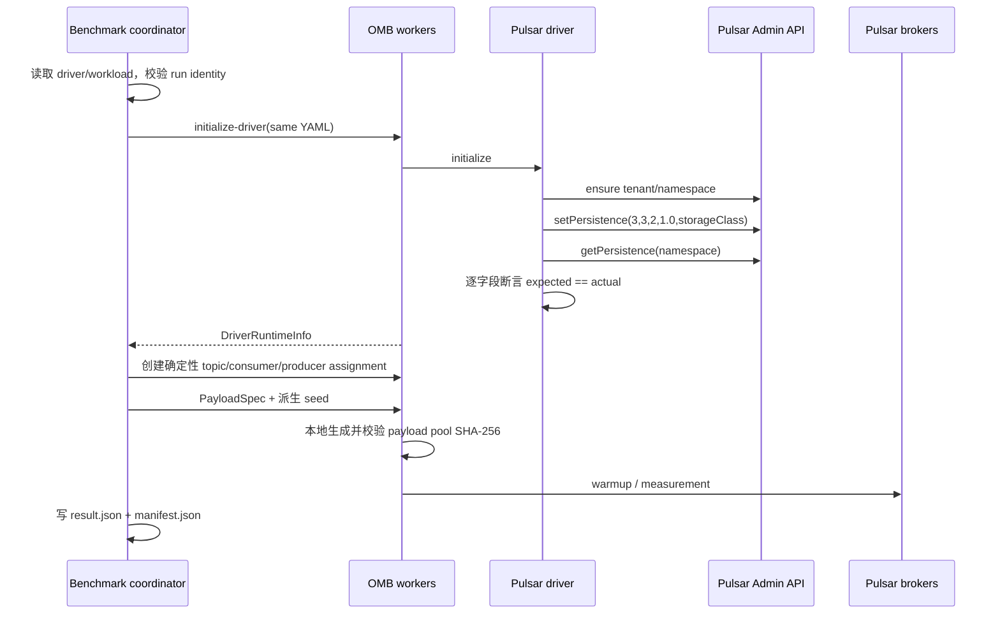

<!--
Licensed to the Apache Software Foundation (ASF) under one
or more contributor license agreements.  See the NOTICE file
distributed with this work for additional information
regarding copyright ownership.  The ASF licenses this file
to you under the Apache License, Version 2.0 (the
"License"); you may not use this file except in compliance
with the License.  You may obtain a copy of the License at

http://www.apache.org/licenses/LICENSE-2.0

Unless required by applicable law or agreed to in writing,
software distributed under the License is distributed on an
"AS IS" BASIS, WITHOUT WARRANTIES OR CONDITIONS OF ANY
KIND, either express or implied.  See the License for the
specific language governing permissions and limitations
under the License.
-->

# Nereus v0.1.0 OpenMessaging Benchmark 代码级详细设计

状态：已实施（代码、配置模板和运行脚本已落地；集群级门禁仍需在目标 Kubernetes 环境执行）

适用代码基线：

- OpenMessaging Benchmark：`pulsar` 分支，设计审计基线
  `db8a480bd2370ad21ba32d48ec1a96c17d3563f4`
  （`Support delayed messages`）；
- Apache Pulsar API：tag `v5.0.0-M1`，SHA
  `8dae0236c0a0d405ed7f8303081080520fe91551`；
- Nereus Pulsar：从同一 `v5.0.0-M1` 基线构造的
  `5.0.0-M1-nereus`；
- Nereus：`v0.1.0`。

本文是 OMB 代码、配置、运行清单和正式 workload 的权威实现设计。
Pulsar/Nereus 的 A–E 部署、激活、验证、证据归档和冷重置仍以
`pulsar-helm-chart` 仓库中的
`nereus-v0.1.0-helm-chart-code-level-design.md` 为准。

当前实现已经覆盖 driver 的 `5.0.0-M1` API 对齐、namespace persistence
storage-class 写入/回读、确定性 run/seed/payload/assignment、Shared consumer
fan-out、B1 broker backlog 读数、R1 事件记录、失败 manifest、OMB immutable
image digest 和 Helm digest 渲染。R1 的故障注入脚本接收操作侧确定的 owner broker
Pod；若提供 `R1_OWNER_MAP_BEFORE`/`R1_OWNER_MAP_AFTER`，会把两份 owner 快照写入
故障事件。这样不会让通用脚本隐式改变 Pulsar owner 选择，但正式报告必须保留该
选择依据。

---

# 1. 目标与最终决策

本轮不是为 OMB 增加一组“能跑起来”的 YAML，而是要保证 A–E 五个 Stage
运行的是同一份可重放负载，并且每个结果都能证明实际使用了预期的
ManagedLedger storage class。

最终决策如下：

1. OMB Pulsar driver 使用精确的 Pulsar `5.0.0-M1` client/admin API。
2. A/B 的 namespace 显式绑定 `bookkeeper`；C/D/E 显式绑定 `nereus`。
3. driver 写入 namespace persistence policy 后立即通过 admin API 回读并逐字段断言。
   回读不通过时，任何 topic、producer 或 consumer 都不能创建。
4. `run.seed` 是一次运行唯一的随机源。payload、topic/subscription 名称、
   producer/consumer assignment、payload selection 和 key distribution 使用相互隔离的
   派生 seed。
5. 同一 block 的 A/B/C/D/E 使用同一个 base seed；下一个 block 使用新的 seed。
6. namespace 和 run ID 显式固定，不再依赖无 seed 的随机后缀。
7. 主基线固定 `compressionType: NONE`。LZ4 是独立 campaign，不能与 NONE
   混入同一主结果表。
8. 主基线使用 100% 随机 payload，避免重复 1 KiB 文件导致对象物化或压缩路径失真。
9. 正式吞吐上限使用显式 rate sweep；现有 `producerRate: 0` 自适应控制器只保留为
   探索工具，不作为 A–E 正式可比结果。
10. 一次正式 run 对应一次全新的 Pulsar Helm install。run 结束后归档证据并执行
    cold reset；不得让上一 run 的 Oxia、BookKeeper 或 SeaweedFS 数据进入下一 run。
11. OMB 镜像也必须由 Git SHA 和 OCI digest 固化。A–E 使用相同 OMB 镜像、
    worker 数量、资源和 placement。
12. 所有配置或运行时断言失败都必须让 `bin/benchmark` 非零退出，并保留失败 manifest。

---

# 2. 范围与非目标

## 2.1 本轮范围

本设计覆盖：

- Pulsar driver 的 storage class 配置、写入和回读；
- Pulsar client 版本对齐；
- run/campaign identity；
- 确定性随机数和 payload；
- compression 配置；
- 结果 manifest 和 fail-closed 语义；
- S1、C1、L1、B1、R1、M1 workload 套件；
- OMB Kubernetes worker 的固定镜像、资源和 placement；
- A–E 冷启动测试编排边界；
- 单元测试、集成测试和 campaign 验收门禁。

## 2.2 本轮非目标

以下内容不进入 v0.1.0 主性能基线：

- delayed delivery；
- transaction；
- broker-side deduplication 对比；
- Key_Shared 语义或 key-based batching；
- TLS/认证开销；
- NONE 与 LZ4 以外的压缩算法；
- 多租户或多 namespace 混合负载；
- 使用旧 OMB 测试结果直接作为新 A–E 的数值基线。

这些功能可以后续建立独立 campaign，不能增加到当前主基线的变量集合中。

---

# 3. 当前代码事实审计

原始方案中的“driver POM 仍然使用 Pulsar client 2.11.0”已经不符合当前
`pulsar` 分支。当前 `driver-pulsar/pom.xml` 实际使用 `4.0.8`。
本轮仍需改成 `5.0.0-M1`，但迁移起点必须按 `4.0.8` 记录。

|                     代码位置                      |                            当前行为                            |                       对正式基线的影响                       |
|-----------------------------------------------|------------------------------------------------------------|------------------------------------------------------|
| `driver-pulsar/pom.xml`                       | `pulsar.version=4.0.8`                                     | API 与被测 `5.0.0-M1` 不完全同版                             |
| `PulsarClientConfig.PersistenceConfiguration` | 只有 `3/3/2` 和 dedup 字段                                      | 无法配置 storage class                                   |
| `PulsarBenchmarkDriver.initialize`            | 使用四参数 `PersistencePolicies`                                | storage class 始终为 `null`                             |
| `PulsarBenchmarkDriver.initialize`            | namespace 使用无 seed 随机后缀                                    | manifest 不能重放相同 namespace                            |
| `WorkloadGenerator`                           | payload 使用 `new Random()`                                  | payload 池不可重放                                        |
| `WorkloadGenerator`                           | producer/consumer 使用无 seed shuffle                         | worker assignment 不可重放                               |
| `WorkloadGenerator`                           | subscription 使用无 seed随机后缀                                  | subscription identity 不可重放                           |
| `LocalWorker`                                 | topic 使用无 seed随机后缀                                         | topic identity 不可重放                                  |
| `LocalWorker`                                 | payload selection 使用 `ThreadLocalRandom`                   | 同一 payload 池的消息分布仍不可重放                               |
| `KeyDistributor`                              | 静态无 seed key 池和 `System.nanoTime()`                        | key workload 不可重放                                    |
| `PulsarBenchmarkDriver.createConsumer`        | 每个 OMB logical consumer 为每个 partition 创建一个 Pulsar consumer | 48 partitions × 4 consumer 实际是 192 个 Pulsar consumer |
| `PulsarProducerConfig`                        | 没有 compression 字段                                          | NONE/LZ4 不能显式成为实验变量                                  |
| `pulsar.yaml`                                 | `subscriptionType: Failover`                               | 4 个 consumer 中只有 active/standby，不是并行消费               |
| `Benchmark.main`                              | 单次运行异常被 catch 后只写日志                                        | shell 可能把失败误判为成功                                     |
| `TestResult`                                  | 无 run ID、seed、namespace、policy、时间戳                         | 结果无法与部署证据可靠关联                                        |
| `WorkloadGenerator` backlog                   | 后台异常只打印，build/drain 时间未写结果                                 | B1 不能作为可审计的 backlog 测试                               |

另有一个分布式初始化约束：`DistributedWorkersEnsemble.initializeDriver()` 会并行让所有
worker 初始化同一份 driver YAML。显式 namespace 后，各 worker 会同时创建同一个
namespace。因此 namespace create 必须幂等处理 `ConflictException`，persistence
写入和回读也必须能容忍多个 worker 写入同一份相同配置。

---

# 4. A–E 对比矩阵

| Stage |             Broker image/data path              | Namespace storage class |        Nereus profile         |
|-------|-------------------------------------------------|-------------------------|-------------------------------|
| A     | Apache Pulsar `v5.0.0-M1`                       | `bookkeeper`            | 不适用                           |
| B     | Nereus broker integration dormant，stock BK path | `bookkeeper`            | `BOOKKEEPER_WAL_ONLY`         |
| C     | Nereus ManagedLedger facade                     | `nereus`                | `BOOKKEEPER_WAL_ONLY`         |
| D     | Nereus facade + async object                    | `nereus`                | `BOOKKEEPER_WAL_ASYNC_OBJECT` |
| E     | Nereus facade + sync object                     | `nereus`                | `BOOKKEEPER_WAL_SYNC_OBJECT`  |

B 和 C 的 profile 字面值相同，但数据路径不同：

- B 的 namespace 走原生 `bookkeeper` storage class；
- C 的 namespace 走 `nereus` storage class。

因此 storage class 的实际回读值是区分 B/C 的强制证据，不能只依赖 Helm
annotation、driver 输入 YAML 或 broker 默认值。

---

# 5. 运行模型



关键顺序不允许调整：

1. 先校验输入；
2. 再创建或确认 namespace；
3. 写入 persistence；
4. 通过 admin API 回读；
5. 回读完全匹配后才允许创建 topic；
6. measurement 成功后才生成成功结果；
7. 任意一步失败都非零退出。

---

# 6. 配置模型

## 6.1 Driver YAML

`run` 位于 driver YAML 顶层，是 framework 和 driver 共同读取的唯一运行身份。
seed 不在 workload YAML 重复配置，避免两份 seed 漂移。

```yaml
name: Pulsar-v5.0.0-M1
driverClass: io.openmessaging.benchmark.driver.pulsar.PulsarBenchmarkDriver

run:
  campaignId: v010-202607
  blockId: c1-rate-100000
  runId: block-01-stage-c-rep-01
  stage: C
  repetition: 1
  seed: 202607250101

client:
  serviceUrl: pulsar://nereus-broker.pulsar.svc.cluster.local:6650
  httpUrl: http://nereus-broker.pulsar.svc.cluster.local:8080
  ioThreads: 16
  connectionsPerBroker: 8
  clusterName: beijing-1-benchmark
  namespacePrefix: benchmark/v010
  namespaceSuffix: block-01-stage-c-rep-01
  topicType: persistent
  persistence:
    ensembleSize: 3
    writeQuorum: 3
    ackQuorum: 2
    managedLedgerStorageClassName: nereus
    deduplicationEnabled: false

producer:
  batchingEnabled: true
  batchingMaxPublishDelayMs: 1
  batchingMaxBytes: 131072
  compressionType: NONE
  compressionMinMsgBodySize: 0
  blockIfQueueFull: true
  pendingQueueSize: 0
  messageDelayMs: 0
  minMessageDelayMs: 0
  maxMessageDelayMs: 0
  delayMessageRatio: 0.0

consumer:
  receiverQueueSize: 1000
  maxTotalReceiverQueueSizeAcrossPartitions: 48000
  subscriptionType: Shared
```

Stage 只允许以下映射：

```text
A -> bookkeeper
B -> bookkeeper
C -> nereus
D -> nereus
E -> nereus
```

campaign renderer 必须校验 `run.runId == client.namespaceSuffix`。这样结果 ID、
namespace identity 和冷启动证据不会分裂。

## 6.2 Workload YAML

正式 C1 的一个固定速率 run 示例：

```yaml
name: nereus-v010-c1-1topic-48partitions-1k-4p-4c-100k

topics: 1
partitionsPerTopic: 48

messageSize: 1024
useRandomizedPayloads: true
randomBytesRatio: 1.0
randomizedPayloadPoolSize: 4096

subscriptionsPerTopic: 1
consumerPerSubscription: 4
producersPerTopic: 4

producerRate: 100000
consumerBacklogSizeGB: 0
warmupDurationMinutes: 5
testDurationMinutes: 15
statsIntervalSeconds: 10
```

正式 workload 不使用 `payloadFile`。`useRandomizedPayloads=true` 时必须满足：

- `messageSize > 0`；
- `0.0 <= randomBytesRatio <= 1.0`；
- `randomizedPayloadPoolSize > 0`；
- `payloadFile` 为空。

主基线固定 `randomBytesRatio=1.0` 和 pool size `4096`。

---

# 7. 代码级改造

## 7.1 `driver-api`：共享 run identity

新增：

```text
driver-api/src/main/java/io/openmessaging/benchmark/driver/RunConfiguration.java
driver-api/src/main/java/io/openmessaging/benchmark/driver/DriverRuntimeInfo.java
```

`RunConfiguration`：

```java
public class RunConfiguration {
    public String campaignId;
    public String blockId;
    public String runId;
    public String stage;
    public int repetition;
    public Long seed;
}
```

seed 使用 `Long` 而不是 `long`，以区分合法的 `0` 和“未配置”。正式 Nereus
campaign 中所有字段必填；普通 OMB driver 为保持兼容可以不提供 `run`。

`DriverRuntimeInfo` 至少包含：

```java
public class DriverRuntimeInfo {
    public RunConfiguration run;
    public String namespace;
    public Map<String, String> attributes = new TreeMap<>();
}
```

Pulsar driver 的 attributes 固定包含：

```text
persistence.bookkeeperEnsemble
persistence.bookkeeperWriteQuorum
persistence.bookkeeperAckQuorum
persistence.managedLedgerMaxMarkDeleteRate
persistence.managedLedgerStorageClassName
namespace.deduplicationEnabled
producer.compressionType
producer.compressionMinMsgBodySize
producer.batchingEnabled
producer.batchingMaxPublishDelayMs
producer.batchingMaxBytes
consumer.subscriptionType
consumer.receiverQueueSize
consumer.maxTotalReceiverQueueSizeAcrossPartitions
```

`BenchmarkDriver` 增加向后兼容的 default 方法：

```java
default DriverRuntimeInfo getRuntimeInfo() {
    return new DriverRuntimeInfo();
}
```

framework 通过 leader worker 读取 runtime info，并校验所有分布式 worker 返回的
run ID、namespace 和 persistence attributes 一致。

## 7.2 `benchmark-framework`：读取并传播 run identity

修改 `DriverConfiguration`：

```java
public RunConfiguration run;
```

`Benchmark` 已经在初始化 driver 前解析 driver YAML，因此把同一个
`RunConfiguration` 传给 `WorkloadGenerator`，不需要第二份 campaign 配置。

`WorkloadGenerator` 构造函数改为：

```java
WorkloadGenerator(
        String driverName,
        RunConfiguration run,
        Workload workload,
        Worker worker)
```

正式 campaign 的 preflight 必须在任何 worker RPC 前校验：

- campaignId、blockId、runId、stage、seed 非空；
- stage 是 A–E；
- repetition 大于 0；
- runId 不包含 `/`、空白或控制字符；
- runId 长度不超过 128；
- workload 参数合法；
- Nereus 主基线 delayed delivery 和 dedup 均关闭；
- 4 个 consumer 时 Pulsar subscription type 是 `Shared`。

## 7.3 Pulsar client 版本

修改 `driver-pulsar/pom.xml`：

```xml
<pulsar.version>5.0.0-M1</pulsar.version>
```

继续使用 `pulsar-client-all`，因为它同时提供 client 和 admin API。
Pulsar `v5.0.0-M1` Java artifacts 以 Java 17 编译；当前 OMB build/runtime
镜像已使用 Eclipse Temurin 17，不应降回 Java 8 runtime。

`pulsar-client-all` 的部分依赖以 `runtime` scope 声明，并由其 manifest 的
`Class-Path` 引用；因此 `package/src/assemble/bin.xml` 的 dependency set 必须使用
`runtime` scope，确保例如 `slog` 进入最终 `lib/`。只使用 `compile` scope 会让
worker 在初始化 Pulsar client 时出现 `NoClassDefFoundError`。

`pulsar-client-all:5.0.0-M1` 还声明未 shading 的
`com.fasterxml.jackson.core:jackson-annotations:2.21`。OMB 原有的全局
`jackson.version=2.13.2` 不能覆盖这个运行时依赖，否则 Pulsar shaded databind
在 admin 初始化阶段会找不到 `JsonSerializeAs`。因此 annotations 单独由
`jackson.annotations.version=2.21` 管理；最终归档只能包含 2.21，不能回落到
2.13.2。

构建证据必须保留：

```bash
mvn -pl driver-pulsar -am dependency:tree \
  -Dincludes='org.apache.pulsar:*'
```

输出中不能同时存在 4.x、2.x 或 `5.0.0-M1-SNAPSHOT` Pulsar client。

发行包还应检查 runtime 依赖已进入归档：

```bash
tar -tzf package/target/openmessaging-benchmark-*-bin.tar.gz \
  | grep '/lib/io.github.merlimat.slog-slog-'

tar -tzf package/target/openmessaging-benchmark-*-bin.tar.gz \
  | grep '/lib/com.fasterxml.jackson.core-jackson-annotations-2.21.jar'

! tar -tzf package/target/openmessaging-benchmark-*-bin.tar.gz \
  | grep -q '/lib/com.fasterxml.jackson.core-jackson-annotations-2.13.2.jar'
```

## 7.4 PersistenceConfiguration

修改
`driver-pulsar/src/main/java/io/openmessaging/benchmark/driver/pulsar/config/PulsarClientConfig.java`：

```java
public static class PersistenceConfiguration {
    public int ensembleSize = 3;
    public int writeQuorum = 3;
    public int ackQuorum = 2;
    public String managedLedgerStorageClassName;
    public boolean deduplicationEnabled = false;
}
```

`managedLedgerStorageClassName` 在普通 OMB 配置中可以为空以保持兼容；在
Nereus campaign 中必须是 `bookkeeper` 或 `nereus`。

## 7.5 Namespace identity

`PulsarClientConfig` 增加：

```java
public String namespaceSuffix;
```

namespace 解析逻辑：

```java
String namespace =
        isBlank(config.client.namespaceSuffix)
                ? config.client.namespacePrefix + "-" + getRandomString()
                : config.client.namespacePrefix + "-" + config.client.namespaceSuffix;
```

Nereus campaign 禁止 fallback 到随机后缀。fallback 只服务于旧 driver YAML。

`namespacePrefix` 必须正好是 `tenant/base` 两段。当前代码只通过
`split("/")[0]` 取 tenant，无法拒绝错误的三段或空 namespace；本轮要在创建
Pulsar client 前完成格式校验。

所有 worker 会并行初始化同一 namespace，创建流程必须是：

```java
try {
    adminClient.namespaces().createNamespace(namespace);
} catch (ConflictException alreadyExists) {
    log.info("Namespace {} already exists; verifying the shared run namespace", namespace);
}
```

不能在 catch 后直接继续。成功创建 namespace 的 worker 必须立即写入：

```text
omb.schema-version
omb.campaign-id
omb.block-id
omb.run-id
omb.stage
omb.repetition
omb.seed
```

遇到 conflict 的 worker 通过 `Namespaces.getProperties(namespace)` 有界重试，
并逐项断言这些 properties 与自己的 `RunConfiguration` 完全一致。这样可以区分：

- 同一批 worker 对同一次 run 的并发初始化：允许；
- 上一次 run 遗留的 namespace、相同 namespaceSuffix 配不同 seed，或人工创建的
  空 namespace：拒绝。

如果遗留 namespace 的全部 run properties 也完全相同，确定性 topic 名称仍会在
topic create 阶段以 conflict 失败，不能静默复用旧数据。

`createTopic` 对 `partitions == 1` 不再 no-op，而是调用：

```java
adminClient.topics().createNonPartitionedTopicAsync(topic);
```

这样单分区 workload 也能在重复 run ID 时 fail-closed，而不是依赖 broker
auto-topic creation。

## 7.6 Persistence 写入和回读

构造完整 policy：

```java
PersistencePolicies expected =
        new PersistencePolicies(
                p.ensembleSize,
                p.writeQuorum,
                p.ackQuorum,
                1.0,
                p.managedLedgerStorageClassName);
```

然后：

```java
adminClient.namespaces().setPersistence(namespace, expected);
PersistencePolicies actual =
        adminClient.namespaces().getPersistence(namespace);
verifyPersistencePolicy(namespace, expected, actual);
```

`verifyPersistencePolicy` 必须逐字段比较：

```java
expected.getBookkeeperEnsemble() == actual.getBookkeeperEnsemble()
expected.getBookkeeperWriteQuorum() == actual.getBookkeeperWriteQuorum()
expected.getBookkeeperAckQuorum() == actual.getBookkeeperAckQuorum()
Double.compare(
        expected.getManagedLedgerMaxMarkDeleteRate(),
        actual.getManagedLedgerMaxMarkDeleteRate()) == 0
Objects.equals(
        expected.getManagedLedgerStorageClassName(),
        actual.getManagedLedgerStorageClassName())
```

不能直接依赖 `PersistencePolicies.equals()`。Apache Pulsar `v5.0.0-M1`
的该方法对 `managedLedgerStorageClassName` 使用引用比较；Nereus 分支才修正为
`Objects.equals`。OMB 必须同时兼容 A 和 B–E。

因为 worker 会并发写入同一份相同 policy，`setPersistence/getPersistence` 使用有界
重试：

- 最多 10 次；
- 初始间隔 100 ms，最大 1 s；
- 只重试 `ConflictException`、暂时性 metadata version conflict，或回读尚未收敛；
- 权限错误、非法 storage class、HTTP 4xx 和最终字段不匹配立即失败；
- 最终异常同时打印 expected、actual、namespace 和 run ID。

回读成功后把 actual policy 写入 `DriverRuntimeInfo`。YAML 输入值只记为 expected，
不能冒充 actual evidence。

deduplication 不属于 `PersistencePolicies`，需要独立写入和回读：

```java
adminClient.namespaces().setDeduplicationStatus(namespace, p.deduplicationEnabled);
Boolean actualDeduplication =
        adminClient.namespaces().getDeduplicationStatus(namespace);
```

Nereus 主 campaign 断言 actual 值明确为 `false`；`null` 不能当作 false。manifest
中的 `namespace.deduplicationEnabled` 记录回读值。

## 7.7 Compression

修改 `PulsarProducerConfig`：

```java
public CompressionType compressionType = CompressionType.NONE;
public int compressionMinMsgBodySize = 0;
```

修改 producer builder：

```java
.compressionType(config.producer.compressionType)
.compressionMinMsgBodySize(config.producer.compressionMinMsgBodySize)
```

必须显式设置 `compressionMinMsgBodySize`。Pulsar `v5.0.0-M1`
的默认阈值是 4 KiB；若只设置 `LZ4` 而不把阈值设为 `0`，1 KiB 主 workload
实际上不会压缩，LZ4 campaign 会变成假对比。

主 campaign：

```yaml
compressionType: NONE
compressionMinMsgBodySize: 0
```

独立 LZ4 campaign：

```yaml
compressionType: LZ4
compressionMinMsgBodySize: 0
```

LZ4 结果目录、campaignId 和汇总表必须与 NONE 分开。

## 7.8 Consumer fan-out 和 receiver queue

当前 Pulsar driver 的一个 OMB logical consumer 会为 topic 的每个 partition 创建一个
底层 Pulsar consumer。正式配置 `48 partitions × 4 consumerPerSubscription`
因此对应 192 个 Pulsar consumer，而不是 4 条物理 consumer connection。

`receiverQueueSize` 对每个 partition consumer 生效。若继续使用当前 10000，
理论 queue 上限达到 1,920,000 条消息，1 KiB payload 尚未计算对象开销就接近
1.9 GiB；10 KiB workload 更不适合这个值。

修改 `PulsarConsumerConfig`：

```java
public int receiverQueueSize = 1000;
public int maxTotalReceiverQueueSizeAcrossPartitions = 48000;
```

并把当前 builder 中的：

```java
.maxTotalReceiverQueueSizeAcrossPartitions(Integer.MAX_VALUE)
```

改为读取配置。初始正式值固定为每个 logical consumer 最多
`48 × 1000 = 48000` 条预取消息。需要注意，当前 driver 为每个 partition
创建独立 `Consumer`，所以 Pulsar builder 的 `maxTotalReceiverQueueSizeAcrossPartitions`
并不能跨这 48 个对象形成全局 cap；当前 aggregate 上限来自
`partition count × receiverQueueSize` 的显式计算。该字段仍要配置，防止以后改成由
一个 Consumer 直接订阅 partitioned topic 时重新出现无界上限。

S1 可以验证这个值是否限制吞吐；若要调整，必须在
campaign 开始前统一调整并冻结，A–E 之间不得改变。

manifest 同时记录 logical consumer count、physical Pulsar consumer count 和两个
queue 参数，避免把客户端 fan-out 差异误认为 broker/storage 差异。

## 7.9 确定性 seed 派生

新增：

```text
benchmark-framework/src/main/java/io/openmessaging/benchmark/utils/SeedDerivation.java
```

不能让所有子系统共享一个顺序消耗的 `Random`。否则给 payload 增加一次随机调用就会
改变 producer assignment。使用固定算法从 base seed 派生独立 seed：

```java
long derive(long baseSeed, String domain, long ordinal)
```

算法固定为：

1. 按 UTF-8 编码 `domain`；
2. 对 `baseSeed || domainLength || domain || ordinal` 计算 SHA-256；
3. 取 digest 前 8 字节，按 big-endian 解释为 signed long。

domain 名称是兼容性协议，不能随意修改：

```text
payload-pool
topic-name
subscription-name
consumer-assignment
producer-assignment
worker-payload-selection
executor-payload-selection
key-pool
key-selection
```

单元测试要固化至少三组输入/输出向量。以后改变算法或 domain 名称必须视为
replay format 变更。

## 7.10 PayloadSpec：在 worker 本地生成 payload 池

当前 `ProducerWorkAssignment` 直接包含 `List<byte[]> payloadData`。如果使用
4096 个 10 KiB payload，JSON/base64 RPC 会超过 50 MiB，并给 coordinator、
Jetty 和每个 worker 造成额外内存与网络压力。

新增：

```text
benchmark-framework/src/main/java/io/openmessaging/benchmark/worker/commands/PayloadSpec.java
benchmark-framework/src/main/java/io/openmessaging/benchmark/utils/payload/PayloadPoolFactory.java
```

模型：

```java
public class PayloadSpec {
    public PayloadMode mode;
    public int messageSize;
    public double randomBytesRatio;
    public int poolSize;
    public long seed;
    public String expectedSha256;
    public byte[] inlinePayload;
}
```

行为：

- `RANDOMIZED`：worker 根据 spec 本地生成 payload pool；
- `INLINE`：兼容旧 `payloadFile`，只传一份 payload；
- 生成算法仍保持“前 N 字节随机，剩余字节为 0”；
- `randomBytesRatio=1.0` 时全部字节随机；
- coordinator 和 worker 分别计算按 pool index 顺序拼接的 SHA-256；
- worker checksum 与 `expectedSha256` 不一致时拒绝启动负载。

`ProducerWorkAssignment` 用 `PayloadSpec payloadSpec` 替代正式 campaign 的
`payloadData`。旧字段可以在一个兼容周期内保留，但两个字段同时出现必须失败。

## 7.11 Assignment 和 payload selection

`WorkloadGenerator` 修改为：

```java
Collections.shuffle(
        consumerAssignment.topicsSubscriptions,
        new Random(derive(seed, "consumer-assignment", 0)));

Collections.shuffle(
        fullListOfTopics,
        new Random(derive(seed, "producer-assignment", 0)));
```

topic 和 subscription 后缀使用各自派生 seed。相同 run identity 必须产生完全相同的
名称列表和 assignment list。

`ProducerWorkAssignment` 增加 worker payload selection seed。
`DistributedWorkersEnsemble.startLoad()` 按冻结的 `producerWorkers` 顺序为每个 worker
派生不同 seed；`LocalWorker` 再按 executor ordinal 派生线程本地 seed。
`ThreadLocalRandom` 不再用于 payload selection。

正式 campaign 固定 `keyDistributor: NO_KEY`。同时应把
`KeyDistributor.build(type)` 扩展为 `build(type, seed)`，移除静态无 seed key pool
和 `System.nanoTime()`，以免后续 key workload 误称为可重放。

当前 delayed delivery 的随机 delay 仍使用 `ThreadLocalRandom`。主 campaign
强制 `delayMessageRatio=0.0`；未来 delayed campaign 必须另行把 producer ordinal
和派生 seed 传入 `PulsarBenchmarkProducer`。

## 7.12 Worker runtime info RPC

`Worker` 增加：

```java
DriverRuntimeInfo getDriverRuntimeInfo() throws IOException;
```

对应修改：

- `LocalWorker`：返回当前 driver 的 runtime info；
- `WorkerHandler`：新增 `GET /driver-runtime-info`；
- `HttpWorkerClient`：反序列化 runtime info；
- `DistributedWorkersEnsemble`：读取所有 worker，验证关键字段一致，返回 leader 值。

只有所有 worker 的 namespace、run ID、seed 和 persistence actual policy 一致时，
framework 才能进入 topic create。

## 7.13 Result、manifest 和非零退出

新增：

```text
benchmark-framework/src/main/java/io/openmessaging/benchmark/RunManifest.java
benchmark-framework/src/main/java/io/openmessaging/benchmark/PeriodSample.java
```

每个 run 输出独立目录：

```text
results/<campaignId>/<runId>/
├── driver.yaml
├── workload.yaml
├── manifest.json
├── result.json
├── benchmark.log
├── fault-events.jsonl
└── sha256sums.txt
```

`manifest.json` 至少包含：

- manifest schema version；
- campaignId、blockId、runId、stage、repetition、seed；
- startedAt、measurementStartedAt、endedAt；
- OMB Git SHA、image name、OCI target digest、runtime config ID；
- Kubernetes context、Kubernetes namespace、Pulsar Helm release 和 cluster name；
- `pulsar-helm-chart` deployment `run.env` 路径及其 SHA-256；
- Helm evidence archive 路径及 SHA-256；run 尚未结束时该字段可以为空，
  归档完成后必须回填；
- Pulsar stage、broker image ID、Nereus source identity；
- worker URL 的有序列表、worker count 和 role assignment；
- driver/workload 原文 SHA-256；
- namespace；
- expected 和 actual persistence policy；
- compression、batching、subscription；
- payload spec 和 payload pool SHA-256；
- topic/subscription/producer assignment SHA-256；
- status：`PREPARED`、`RUNNING`、`SUCCEEDED` 或 `FAILED`；
- 失败类型和 message，但不记录 Secret。

manifest 在开始负载前先以 `PREPARED` 原子写入；每次状态更新写临时文件后 rename。
即使 JVM 或 broker 在测试中失败，也应保留最后一个可读 manifest。

`PeriodSample` 使用明确时间轴：

```java
public long elapsedSeconds;
public double publishRate;
public double publishThroughputMiB;
public double publishErrorRate;
public double consumeRate;
public double consumeThroughputMiB;
public long backlogMessages;
public long inFlightSends;
// publish/end-to-end latency percentiles
```

当前平行数组继续写入一个兼容周期，但正式分析只读取 `samples`，避免数组错位和缺少
时间轴。

`Benchmark.main` 不再吞掉单次运行异常：

- 任意 driver/workload 失败，记录失败 manifest；
- 停止所有 worker；
- 关闭 worker；
- 最终非零退出；
- 不生成 `SUCCEEDED` result；
- campaign wrapper 同时断言 result 和 manifest 存在且 checksum 正确。

`MessageProducer` 在调用 `sendAsync` 前增加 in-flight counter，并在成功或失败
completion 中减少；`WorkerStats`、`PeriodStats` 和 `CountersStats` 暴露该值。
C1 的“publish queue 未持续增长”门禁使用 measurement 后半段
`inFlightSends` 斜率判断，而不是依赖不可见的客户端内部状态。

## 7.14 Backlog phase

B1 不能只依赖当前后台线程和普通延迟数组。需要显式阶段状态：

```text
PREPARE_SUBSCRIPTION
BUILD_BACKLOG
DRAIN_BACKLOG
POST_DRAIN_STEADY
COMPLETE
```

`BenchmarkConsumer` 增加向后兼容的 default `pause()` / `resume()`。
`PulsarBenchmarkConsumer` 对每个底层 Pulsar consumer 调用真实
`Consumer.pause()` / `Consumer.resume()`；`LocalWorker` 不再用 callback 内
sleep 模拟 pause。

B1 结果增加：

```text
requestedBacklogBytes
backlogAtDrainStartMessages
backlogBuildDurationSeconds
backlogDrainDurationSeconds
averageDrainRateMessagesPerSecond
peakDrainRateMessagesPerSecond
postDrainBacklogMessages
```

`consumerBacklogSizeGB` 表示未压缩 logical payload bytes，便于 A–E 公平对比。
实际 BookKeeper/object-store physical bytes 由集群指标单独记录，不能混为同一口径。

Pulsar driver 在 drain 转换点通过 topic stats 读取 subscription `msgBacklog`，
并把 broker actual backlog 与 OMB counter estimate 一起写入 manifest。

## 7.15 Recovery event

R1 不把 `kubectl delete pod` 写进通用 Java driver。新增 campaign 脚本：

```text
scripts/nereus-benchmark/inject-broker-crash.sh
```

行为：

1. 等待 manifest 进入 `RUNNING` 且 measurement 已稳定；
2. 根据确定性 topic 名称查询 48 个 partition 的 owner；
3. 选择拥有 partition 数最多的 broker；平局时按 Pod 名字典序选择；
4. 记录 fault 前 owner map；
5. 删除该 broker Pod；
6. 记录 request time、Pod deletion time、replacement Ready time 和新 owner map；
7. 输出 `fault-events.jsonl`；
8. 不直接判断性能结果，由 analyzer 根据 OMB 1 秒 sample 计算恢复时间。

R1 的 `statsIntervalSeconds` 固定为 1。恢复定义为：fault 后 publish 和 consume rate
连续 30 秒恢复到 fault 前 2 分钟中位数的 95%，且 backlog 不再增长。

---

# 8. 文件变更清单

## 8.1 修改文件

|                                  文件                                   |                         修改                         |
|-----------------------------------------------------------------------|----------------------------------------------------|
| `driver-pulsar/pom.xml`                                               | Pulsar client 锁到 `5.0.0-M1`                        |
| `driver-api/.../BenchmarkDriver.java`                                 | runtime info default API                           |
| `driver-api/.../BenchmarkConsumer.java`                               | pause/resume default API                           |
| `benchmark-framework/.../DriverConfiguration.java`                    | 读取 `run`                                           |
| `benchmark-framework/.../Benchmark.java`                              | preflight、manifest、非零退出                            |
| `benchmark-framework/.../Workload.java`                               | `statsIntervalSeconds` 和 validation                |
| `benchmark-framework/.../WorkloadGenerator.java`                      | seed、PayloadSpec、phase 和 samples                   |
| `benchmark-framework/.../worker/Worker.java`                          | runtime info RPC                                   |
| `benchmark-framework/.../worker/LocalWorker.java`                     | 确定性 topic/payload selection、真实 pause               |
| `benchmark-framework/.../worker/MessageProducer.java`                 | in-flight send 计数                                  |
| `benchmark-framework/.../worker/WorkerStats.java`                     | in-flight send 指标                                  |
| `benchmark-framework/.../worker/DistributedWorkersEnsemble.java`      | worker seed 和 runtime 一致性                          |
| `benchmark-framework/.../worker/HttpWorkerClient.java`                | runtime info HTTP client                           |
| `benchmark-framework/.../worker/WorkerHandler.java`                   | runtime info endpoint                              |
| `benchmark-framework/.../worker/commands/ProducerWorkAssignment.java` | PayloadSpec 和 seed                                 |
| `benchmark-framework/.../worker/commands/PeriodStats.java`            | in-flight send sample                              |
| `benchmark-framework/.../worker/commands/CountersStats.java`          | in-flight send counter                             |
| `benchmark-framework/.../worker/commands/TopicsInfo.java`             | run/topic identity                                 |
| `benchmark-framework/.../TestResult.java`                             | run metadata、samples、B1/R1 metrics                 |
| `driver-pulsar/.../PulsarClientConfig.java`                           | namespace suffix、storage class                     |
| `driver-pulsar/.../PulsarConfig.java`                                 | `run`                                              |
| `driver-pulsar/.../PulsarProducerConfig.java`                         | compression                                        |
| `driver-pulsar/.../PulsarConsumerConfig.java`                         | receiver queue 总量上限                                |
| `driver-pulsar/.../PulsarBenchmarkDriver.java`                        | namespace、policy set/get/assert、runtime info       |
| `driver-pulsar/.../PulsarBenchmarkConsumer.java`                      | Pulsar pause/resume                                |
| `deployment/kubernetes/helm/benchmark/values.yaml`                    | immutable image、placement、result volume            |
| `deployment/kubernetes/helm/benchmark/templates/*.yaml`               | nodeSelector、tolerations、result mount、identity env |

## 8.2 新增文件

```text
driver-api/src/main/java/io/openmessaging/benchmark/driver/RunConfiguration.java
driver-api/src/main/java/io/openmessaging/benchmark/driver/DriverRuntimeInfo.java
benchmark-framework/src/main/java/io/openmessaging/benchmark/RunManifest.java
benchmark-framework/src/main/java/io/openmessaging/benchmark/PeriodSample.java
benchmark-framework/src/main/java/io/openmessaging/benchmark/utils/SeedDerivation.java
benchmark-framework/src/main/java/io/openmessaging/benchmark/utils/payload/PayloadPoolFactory.java
benchmark-framework/src/main/java/io/openmessaging/benchmark/worker/commands/PayloadSpec.java
driver-pulsar/nereus-v0.1.0/pulsar-stage-template.yaml
workloads/nereus-v0.1.0/s1-smoke.yaml
workloads/nereus-v0.1.0/c1-throughput-template.yaml
workloads/nereus-v0.1.0/l1-latency-template.yaml
workloads/nereus-v0.1.0/b1-backlog-50g.yaml
workloads/nereus-v0.1.0/r1-broker-crash-template.yaml
workloads/nereus-v0.1.0/m1-100b-template.yaml
workloads/nereus-v0.1.0/m1-1k-template.yaml
workloads/nereus-v0.1.0/m1-10k-template.yaml
scripts/nereus-benchmark/render-run-config.sh
scripts/nereus-benchmark/validate-run-config.sh
scripts/nereus-benchmark/preflight-deployment.sh
scripts/nereus-benchmark/run-case.sh
scripts/nereus-benchmark/run-c1-sweep.sh
scripts/nereus-benchmark/inject-broker-crash.sh
scripts/nereus-benchmark/analyze-run.py
scripts/nereus-benchmark/build-omb-image.sh
scripts/nereus-benchmark/containerd-transfer-omb-image.sh
```

---

# 9. Workload 套件

所有正式 suite 的公共配置：

```yaml
topics: 1
partitionsPerTopic: 48
subscriptionsPerTopic: 1
producersPerTopic: 4
consumerPerSubscription: 4
messageSize: 1024
useRandomizedPayloads: true
randomBytesRatio: 1.0
randomizedPayloadPoolSize: 4096
warmupDurationMinutes: 5
```

Pulsar consumer 固定 `Shared`。

在当前 driver 语义下，48 partitions × 4 logical consumer 会创建 192 个底层
Pulsar consumer。正式报告和 worker 容量检查必须使用这个 physical count。

| Suite |          目的           |                        关键参数                         |            主结果             |
|-------|-----------------------|-----------------------------------------------------|----------------------------|
| S1    | 部署 smoke              | 1 topic × 16 partitions，1p/1c，1 KiB，50k msg/s，5 min | 能否稳定收发、policy gate         |
| C1    | 最大可持续吞吐               | 48 partitions，4p/4c，显式 rate sweep                   | stage sustainable rate     |
| L1    | 固定负载延迟                | common ceiling 的 25%/50%/75%                        | publish/e2e p50–p99.99     |
| B1    | backlog/read          | 50 GiB logical backlog 后 drain                      | build time、drain time/rate |
| R1    | broker crash recovery | common ceiling 的 60%，运行中删除 owner broker             | rate 恢复时间、backlog 峰值       |
| M1    | 消息大小敏感性               | 100 B、1 KiB、10 KiB 独立 rate sweep                    | msg/s、MiB/s、latency        |

## 9.1 S1

S1 保留现有 `1 topic × 16 partitions × 1 producer × 1 consumer × 1 KiB ×
50,000 msg/s` 形态，但修改为确定性随机 payload，并缩短为 5 分钟。

S1 只回答：

- OMB 能否连接；
- storage class 回读是否正确；
- producer/consumer 是否正常；
- worker 是否明显成为瓶颈。

S1 不进入正式吞吐结论。

## 9.2 C1 显式 rate sweep

不使用当前 `producerRate: 0` 的在线自适应控制器。每个 candidate rate 是一个独立
cold run。

初始 rate ladder：

```text
50k, 75k, 100k, 150k, 200k, 300k, 400k, 600k, 800k, 1M msg/s
```

如果 50k 首个 candidate 就失败，按 25k、12.5k 继续向下寻找通过点；如果 1M
仍通过，按 1.5 倍继续扩展，直到得到第一个失败点。

找到第一个失败点后，在最后一个通过点与第一个失败点之间二分，直到候选差距不超过
较低点的 5%。边界 candidate 至少重复 3 次。

一个 candidate 被认定为 sustainable，必须同时满足：

1. measurement 平均 achieved publish rate 不低于 target 的 98%；
2. 平均 consume rate 不低于 achieved publish rate 的 99%；
3. publish error / attempted publish 小于 `1e-6`；
4. measurement 后半段 backlog 线性回归斜率不超过 target 的 0.1%；
5. 结束 backlog 不超过 5 秒 target 消息量；
6. OMB producer/consumer worker CPU 均未持续超过 90%；
7. OMB client network 未持续超过可用带宽的 85%；
8. OMB pending publish queue 未持续增长。

每个 Stage 得到自己的 C1 ceiling。定义：

```text
commonSustainableCeiling = min(A, B, C, D, E)
```

L1 和 R1 只使用这个共同上限，不能使用各 Stage 自己的上限，否则延迟和恢复结果不是
同负载对比。

## 9.3 L1

固定三个 target：

```text
0.25 × commonSustainableCeiling
0.50 × commonSustainableCeiling
0.75 × commonSustainableCeiling
```

每个 target 独立 cold run，measurement 至少 30 分钟。主指标：

- publish latency p50/p75/p95/p99/p99.9/p99.99/max；
- end-to-end latency相同分位；
- publish/consume rate；
- backlog；
- broker、bookie、Oxia、SeaweedFS 和 OMB 资源指标。

## 9.4 B1

v0.1.0 第一轮固定 50 GiB logical backlog。100 GiB 只在磁盘容量和完整冷重置
耗时验证后作为第二轮，不与 50 GiB 混表。

producer 在 drain 期间继续以 `0.50 × commonSustainableCeiling` 发布。
主指标是 drain throughput 和 drain duration，而不是 backlog 消息的 end-to-end
latency；后者天然包含等待时间，只作为辅助数据。

## 9.5 R1

固定 `0.60 × commonSustainableCeiling`：

- warmup 5 分钟；
- pre-fault measurement 5 分钟；
- 删除 owner broker；
- post-fault 至少 10 分钟；
- 1 秒 sample；
- replacement broker Ready 后继续观察至 rate/backlog 恢复或超时。

R1 的 Stage A–E 使用同一 fault 选择规则，但必须记录每次实际被删除的 Pod 和
partition owner map。

## 9.6 M1

100 B、1 KiB、10 KiB 分别进行独立 rate sweep。三个大小不能共用 msg/s candidate
上限；结果同时报告 msg/s 和 MiB/s。

主基线仍为：

```yaml
randomBytesRatio: 1.0
randomizedPayloadPoolSize: 4096
compressionType: NONE
```

---

# 10. Block、seed、重复与冷启动

一次可比 block 固定：

- suite/case；
- target rate；
- message size；
- compression；
- batching；
- worker image/count/placement/resources；
- base seed。

同一个 block 的 A–E 只改变 Stage。示例：

```text
campaignId: v010-202607
blockId: c1-rate-100000
base seed: 202607250101

block-01-stage-a-rep-01
block-01-stage-b-rep-01
block-01-stage-c-rep-01
block-01-stage-d-rep-01
block-01-stage-e-rep-01
```

下一 block 使用新 seed。正式 case 至少 3 个 repetition。

为降低 A→E 固定时间顺序造成的温度、后台任务或外部网络偏差，三次 repetition
轮换 Stage 顺序：

```text
rep-01: A B C D E
rep-02: C D E A B
rep-03: E A B C D
```

每个 `(block, stage, repetition)` 的流程：

1. 确认没有 `pulsar/nereus` release 和遗留核心 PVC；
2. Helm install 对应 Stage；
3. B–E 完成 publication activation、object-store contract 和 release verify；
4. renderer 生成唯一 driver/workload；
5. validator 校验 stage/storage class、seed、image identity 和 worker identity；
6. OMB 执行一次 run；
7. driver 回读 namespace persistence 并写 manifest；
8. 停止全部 load client；
9. 收集 OMB、Prometheus 和 Helm evidence；
10. 执行 `reset-nereus-benchmark-stage.sh --execute`；
11. 确认 16 个核心数据 PVC 已清理、静态 PV 回到 `Available`；
12. 才能进入下一个 run。

OMB Helm release 可以保持运行，但每次 run 前必须 `stopAll` 成功，且使用相同的
immutable OMB image。被测 Pulsar release 和数据必须每 run 重建。

---

# 11. OMB Kubernetes 部署与镜像

## 11.1 Immutable OMB image

当前 Chart 默认：

```yaml
numWorkers: 2
image: openmessaging/openmessaging-benchmark:pulsar
imagePullPolicy: IfNotPresent
```

worker 数量已经固定为 2，但默认镜像仍是可变 tag，不能用于正式 campaign。
实现完成并 commit 后构建：

```text
nereus-benchmark/openmessaging-benchmark:
  pulsar-b<OMB_SHORT_SHA>-amd64
```

build manifest 至少记录：

- 完整 OMB Git SHA；
- tree clean；
- Dockerfile SHA-256；
- image tag；
- OCI target digest；
- runtime config ID；
- platform；
- tar SHA-256。

containerd 环境在 `k8s.io` namespace 构建或导入。镜像必须存在于所有可能调度
OMB driver/worker 的节点；Chart 正式 values 使用 `imagePullPolicy: Never`。

正式 values 至少覆盖：

```yaml
numWorkers: 2
image: nereus-benchmark/openmessaging-benchmark:pulsar-b<OMB_SHORT_SHA>-amd64
imagePullPolicy: Never
```

`run-case.sh` 在启动 OMB 前读取 Helm campaign 的 `results/deploy/latest.env`，
逐项断言当前 context、`pulsar/nereus`、Stage 和 cluster identity 一致，并把
该文件 checksum 写入 OMB manifest。失败 deployment 的私有 `RUN_DIR/run.env`
只能通过显式参数选择，不能伪造或覆盖 `latest.env`。

## 11.2 Worker placement

两节点基准的固定边界：

- Pulsar、BookKeeper、Oxia：`workload=pulsar`；
- SeaweedFS：`workload=apps,nereus-object-store=true`；
- OMB driver/worker：初始放到 `workload=apps`，但与 SeaweedFS 使用独立 CPU
  allocation 和结果盘。

Chart 增加：

```yaml
driver:
  nodeSelector:
    workload: apps
  resources:
    requests:
      cpu: "2"
      memory: 4Gi
    limits:
      cpu: "2"
      memory: 4Gi

workers:
  nodeSelector:
    workload: apps
  resources:
    requests:
      cpu: "2"
      memory: 6Gi
    limits:
      cpu: "2"
      memory: 6Gi
```

正式分布式模式固定使用 2 个 worker，OMB 将其分成 1 个 producer worker 和
1 个 consumer worker。每个 worker 的 JVM 默认使用 4 GiB heap，因此 Pod
固定预留 6 GiB，为 direct buffer、metaspace、线程栈和其他 native allocation
保留 2 GiB。S1/C1 预检必须确认这两个 worker 不是客户端瓶颈；如果无法满足，
应增加独立负载节点并开始新的 campaign，不能在当前 A–E campaign 中途改变
worker 数量或资源。

apps 节点使用 Intel 混合 P-Core/E-Core 时，不能假设某个固定逻辑 CPU 编号范围
就是 P-Core。部署前先根据 `lscpu -e=CPU,CORE,SOCKET,ONLINE,MAXMHZ` 和
thread sibling 映射确认 P/E CPU 集合。推荐在 kubelet 启用 `static` CPU Manager
和 `full-pcpus-only`，并把所有 E-Core 逻辑 CPU 写入
`reservedSystemCPUs`。SeaweedFS 和 OMB worker 都必须保持整数 CPU 且
requests 等于 limits；这样它们从剩余的 P-Core 集合获得独占的完整物理核。
当前 campaign 将 SeaweedFS request 和 limit 固定为 `cpu: "4"`，在当前
2-thread P-Core 上代表两个完整 P-Core；两个 OMB worker 各使用
`cpu: "2"`，分别获得一个完整 P-Core。每次部署后必须从
`/var/lib/kubelet/cpu_manager_state` 和容器的 `Cpus_allowed_list` 收集实际
CPUSet 证据。

若 apps 节点 CPU、NIC 或磁盘因 SeaweedFS 与 OMB 共存达到瓶颈，应把 OMB 移到
独立外部负载机；不能只为 D/E 临时增加 worker 或 CPU。

## 11.3 Result volume

driver Pod 不能只把结果留在容器 writable layer。Chart 增加：

```yaml
results:
  existingClaim: omb-results
  mountPath: /results
```

OMB result PVC 不得与 SeaweedFS 数据路径共用。每个 run 的 manifest/result/log
完成后还要复制到 campaign evidence 目录，并生成 SHA-256 sidecar。

---

# 12. 历史测试步骤的沿用边界

附带的旧步骤可以沿用三类结构：

- 单分区最大吞吐形态；
- 多分区固定速率 publish latency 形态；
- 50 GiB backlog 后 drain 形态。

旧数值不能直接进入本轮基线，原因如下：

1. 旧 Test1-Case1 平均 publish 约 185k msg/s、consume 约 99k msg/s，存在持续
   backlog，因此它不是“最大可持续吞吐”；
2. 旧多分区用 100 partitions，本轮主线先固定 48；
3. 旧随机 payload 是 `randomBytesRatio=0.5`、pool size 1000；
4. 旧结果没有 seed、run ID、storage class actual policy 或 image digest；
5. 旧 driver 的 subscription/storage/compression 运行时状态未被固化；
6. 旧 backlog 表主要显示普通 latency，未记录 backlog build/drain duration；
7. 旧 200k 固定负载描述为 200 MB/s，但 200k × 1024 bytes 的准确口径约为
   195.3 MiB/s，正式报告必须同时区分 MB/s 与 MiB/s。

历史结果只用于选择第一轮 rate ladder 和验证新结果量级，不用于计算 A–E
提升比例。

---

# 13. 测试设计

## 13.1 Driver 单元测试

扩展 `PulsarBenchmarkDriverTest`：

- 五参数 policy 包含 `bookkeeper`；
- 五参数 policy 包含 `nereus`；
- actual storage class mismatch 必须失败；
- 使用两个内容相同但引用不同的 String，逐字段验证仍通过；
- 3/3/2 任一字段 mismatch 必须失败；
- namespaceSuffix 生成确定性 namespace；
- Nereus campaign 缺 storage class 失败；
- Stage C 配 `bookkeeper` 被 campaign validator 拒绝；
- compression NONE/LZ4 正确进入 builder configuration；
- `compressionMinMsgBodySize=0` 被保留。

## 13.2 Framework 单元测试

新增：

- `SeedDerivationTest`：固定 test vectors、不同 domain/ordinal 不同；
- `PayloadPoolFactoryTest`：同 seed 同 checksum，不同 seed 不同 checksum；
- `WorkloadGeneratorDeterminismTest`：topic/subscription/assignment 可重放；
- `LocalWorkerPayloadSelectionTest`：同 worker/executor seed 同序列；
- `DistributedWorkersEnsembleTest`：worker seed 唯一且顺序稳定；
- `PulsarConsumerFanOutTest`：48 × 4 的 physical consumer count 和 queue cap 正确；
- `InFlightSendMetricsTest`：成功、失败和异常 completion 都归零；
- `RunManifestTest`：状态更新原子、失败 manifest 可读；
- `BenchmarkExitCodeTest`：driver initialization 失败时非零退出；
- `BacklogPhaseTest`：build/drain 异常传播，不得只打印。

## 13.3 模块构建

```bash
mvn -pl driver-pulsar -am test
mvn -pl benchmark-framework -am test
mvn clean verify
```

## 13.4 Pulsar 集成门禁

在正式 A–E 前先完成：

1. Stage A 启动 S1，actual policy 是 `3/3/2 + bookkeeper`；
2. Stage B 启动 S1，actual policy 仍是 `3/3/2 + bookkeeper`；
3. Stage C 启动 S1，actual policy 是 `3/3/2 + nereus`；
4. D/E 同样回读 `nereus`；
5. 故意把 C 配成 `bookkeeper`，validator 必须在 load 前失败；
6. 故意让 admin 回读返回 null/错误 storage class，driver 必须非零退出；
7. 两次相同 seed 的 dry-run manifest 中 payload checksum 和 assignment checksum
   完全相同；
8. 两次不同 seed 至少 payload checksum 不同；
9. worker image ID/digest 在所有 Stage 完全相同。

---

# 14. 实施顺序

建议按以下 commit 边界实施：

## Commit 1：Pulsar storage class correctness

- Pulsar client `5.0.0-M1`；
- storage class 字段；
- deterministic namespace suffix；
- policy set/get/field-by-field assert；
- driver tests。

完成标准：A/B 能证明 `bookkeeper`，C/D/E 能证明 `nereus`。

## Commit 2：Run identity 和 deterministic payload

- RunConfiguration；
- SeedDerivation；
- PayloadSpec/PayloadPoolFactory；
- deterministic name/shuffle/selection；
- worker seed propagation；
- tests。

完成标准：同 seed 的 payload/assignment checksums 可重放。

## Commit 3：Compression 和 manifest

- NONE/LZ4；
- compression min size；
- DriverRuntimeInfo RPC；
- manifest、samples、非零退出；
- result checksum。

完成标准：失败不能生成成功结果，成功结果包含 actual policy。

## Commit 4：正式 workload 和 runner

- S1/C1/L1/B1/R1/M1；
- config renderer/validator；
- rate analyzer；
- crash injector；
- backlog phase。

完成标准：单个 block 能依次完成 A–E 冷运行并生成相同 schema 的结果。

## Commit 5：OMB immutable image 和 Helm

- image build/transfer manifest；
- Chart image pinning；
- driver/worker placement/resources；
- result PVC；
- render tests。

完成标准：containerd 节点上的 Pod imageID 与 build manifest 一致。

---

# 15. 最终验收条件

只有同时满足以下条件，OMB 才可用于 Nereus v0.1.0 正式性能结论：

1. `mvn clean verify` 通过；
2. OMB image 由 clean Git SHA 构建并以 digest 固化；
3. A/B actual namespace policy 是 `bookkeeper`；
4. C/D/E actual namespace policy 是 `nereus`；
5. 五组都是 3/3/2；
6. 同 block 的 seed、payload checksum、assignment checksum 一致；
7. NONE 主基线和 LZ4 campaign 完全分离；
8. 正式 4 consumer 使用 Shared；
9. C1 使用显式 rate sweep；
10. L1/R1 使用五组共同 sustainable ceiling；
11. B1 记录 build/drain 指标；
12. R1 记录 fault 和 owner evidence；
13. OMB worker 未成为 CPU、network 或 publish queue 瓶颈；
14. 每个 run 都有成功或失败 manifest；
15. 任何断言失败都非零退出；
16. 每个正式 run 后完成证据归档和冷重置。

在这些门禁完成前，现有 OMB 只适合作为部署 smoke test，不能作为 A–E
最终性能比较的证据来源。
